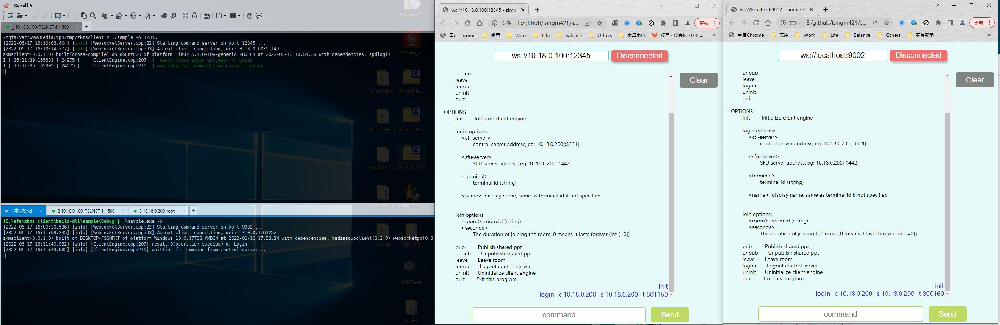

# sample-terminal-web
用于控制sample的web端示例

利用websocket连接到sample，一旦连接成功后，会收到sample返回的所有支持的命令行描述。

在`command`中输入指令并发送，控制sample的初始化、登录会控等操作。

本地版: 打开当前目录下的 `index.html`

[在线版](http://sample-terminal-gh.luanhui.cf/)